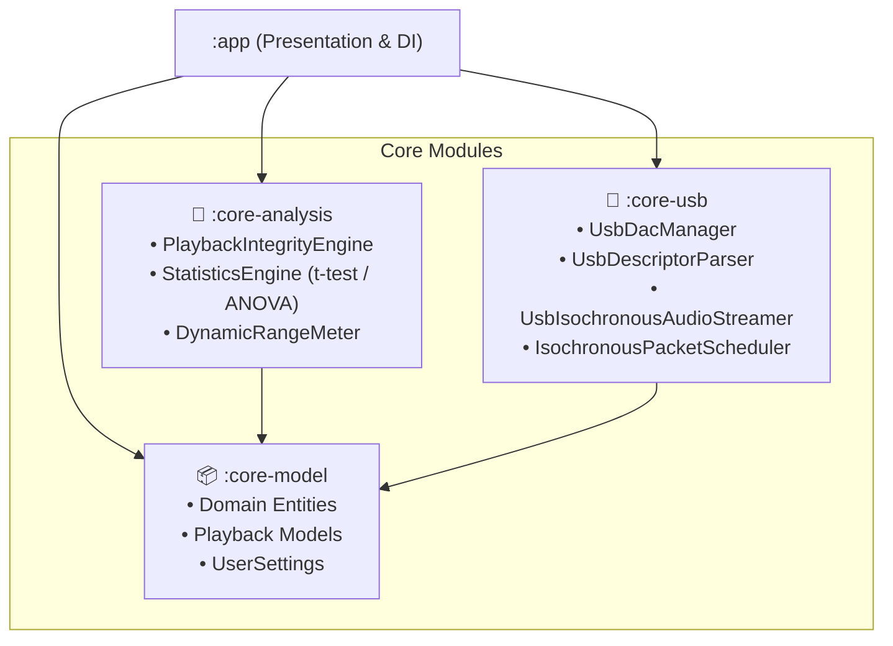

<div align="center">

# 🎵 BitPerfect USB Audio Player & Research Suite

**An Audiophile Music Player & Custom User-Space USB Audio Class Driver for Android**

[-3DDC84?logo=android&logoColor=white)](#requirements)
[](#tech-stack)
[](#tech-stack)
[](#architecture)
[](#license)
[](#installation)

<p align="center">
  <b>Bypasses Android AudioFlinger • 100% Bit-Perfect USB Direct Playback • AI Vocal Separation & Karaoke • AutoEQ 5000+ Profiles • Real-Time CRC32 Transfer Verification • Academic Benchmarking Suite (Welch's t-test / ANOVA)</b>
</p>

---

</div>

## 📌 Table of Contents

- [Overview](#-overview)
- [Key Features](#-key-features)
  - [1. User-Space USB Direct Engine (Bit-Perfect)](#1-user-space-usb-direct-engine-bit-perfect)
  - [2. AI Audio & Karaoke Suite](#2-ai-audio--karaoke-suite)
  - [3. Audiophile DSP Pipeline](#3-audiophile-dsp-pipeline)
  - [4. AutoEQ Headphone & IEM Optimization](#4-autoeq-headphone--iem-optimization)
  - [5. Advanced Library, CUE & Lyrics Engine](#5-advanced-library-cue--lyrics-engine)
  - [6. Academic Benchmarking & Statistical Framework](#6-academic-benchmarking--statistical-framework)
- [Architecture & Module Design](#-architecture--module-design)
- [How Bit-Perfect Playback Works](#-how-bit-perfect-playback-works)
- [Screenshots & UI Walkthrough](#-screenshots--ui-walkthrough)
- [Installation & Setup](#-installation--setup)
- [Hardware Compatibility](#-hardware-compatibility)
- [Academic Context & Research Thesis](#-academic-context--research-thesis)
- [Tech Stack](#-tech-stack)
- [Contributing](#-contributing)
- [License](#-license)

---

## 🌟 Overview

**BitPerfect USB** is a reference-grade Android music player and research platform designed to solve Android's notorious audio architecture limitations. By default, Android routes all audio through **AudioFlinger**, which forces sample-rate conversion (typically resampling everything to 48kHz), truncates 24-bit/32-bit audio to 16-bit, and applies mixer volume degradation.

BitPerfect USB implements a **custom user-space USB Audio Class (UAC1 & UAC2) driver** written from scratch in Kotlin over Android's USB Host APIs. It talks directly to attached USB DACs via asynchronous isochronous endpoints, completely bypassing AudioFlinger, Android Audio HAL, and kernel ALSA mixer layers.

In addition to bit-perfect streaming, the app provides a full suite of **On-Device AI DSP tools** (Real-time Karaoke vocal extraction/isolation, SOLA pitch shifting, DSEE upscaling, AutoEQ 5000+ headphone correction, romanized synchronized lyrics, CUE sheet parsing) and an **Academic Benchmarking Engine** running automated statistical experiments (Welch's t-test and One-Way ANOVA) directly on-device.

---

## 🚀 Key Features

### 1. User-Space USB Direct Engine (Bit-Perfect)
- **Zero AudioFlinger Interference**: Streams lossless PCM (16/24/32-bit, up to 768kHz) and DSD/DoP directly to USB DAC endpoints.
- **Hardware Alternate-Setting Negotiation**: Dynamically queries DAC descriptors and issues `SET_INTERFACE` control requests for the exact (sample rate, bit depth, channel count) combination.
- **Hardware Master Clock Control**: Issues `SET_CUR` sampling frequency / clock source requests to switch the DAC's internal oscillator to match the track's native frequency.
- **Fractional Sample-Accurate Isochronous Scheduler**: Linux `snd-usb-audio`-grade fractional remainder accumulator (e.g. 44/45 frames per packet for 44.1kHz) ensuring long-term exact frame delivery.
- **Dual Transfer Strategies**:
  - **Pipelined (N-Buffering)**: Queues multiple `UsbRequest` frames ahead to absorb Android kernel scheduling jitter.
  - **Synchronous**: Direct blocking submission for ultra-low latency testing.
- **Live CRC32 Transfer Verifier**: Cryptographically computes dual running CRC32 checksums (`Source Decoded` vs. `Transmitted to Wire`) providing mathematical proof of bit-perfect delivery.
- **Live USB Traffic Logger & Descriptor Explorer**: Real-time packet inspector and Device-Manager-style USB descriptor tree builder.

### 2. AI Audio & Karaoke Suite
- **Real-Time Vocal Suppression & Isolation (`AiVocalIsolator`)**:
  - **Instrumental Mode**: Surgical center lead vocal suppression down to `-26dB` with bass (<160Hz) kick protection and high-end air (>8kHz) preservation.
  - **Acapella Mode**: Solo lead vocal isolation for singing practice.
  - **Zero-Distortion DSP**: Leaky power & cross-correlation envelope follower eliminates zero-crossing chatter, harmonic buzz, and artifacts.
  - **Zero-Crosstalk Retention**: Hard-panned stereo instruments (reverberant guitars, wide synths, backing layers) retain 100% stereo imaging.
- **Offline Stem Extraction (`AiStemExtractor`)**: Pre-renders full tracks into isolated Instrumental/Acapella WAV stems with atomic multi-bit depth unpacking (16/24/32-bit) and instant caching.
- **On-Device Neural Engine (`TfliteVocalSeparator`)**: Demucs/Spleeter-style 2048-point STFT Overlap-Add (OLA) frequency-domain Wiener ratio masking.
- **Sony DSEE-Style Spectral Upscaler**: Synthesizes and restores high-frequency harmonics lost during lossy compression.
- **SOLA Real-Time Pitch Shifter**: Crossfaded dual-grain Synchronized Overlap-Add key transposer (±6 semitones) without tempo changes.
- **Live Pitch Detection & Karaoke Mic Scorer (`KaraokeMicScorer`)**: Detects fundamental vocal pitch (F0), matches musical note intervals, and provides real-time scoring.

### 3. Audiophile DSP Pipeline
- **10-Band Precision Equalizer**: 31Hz to 16kHz graphic/parametric EQ with FLAT, BASS BOOST, VOCAL, TREBLE, and AUDIOPHILE presets.
- **Spatial Soundstage Stereo Expander**: Poweramp-style inter-aural stereo width enhancer (0.0x Mono to 2.0x Super-Wide).
- **Studio Acoustic Reverb Simulator**: Real-time acoustic space simulator (Studio Room, Chamber, Concert Hall, Cathedral).
- **Headphone Crossfeed Processor**: Low-pass blended inter-channel feed reducing headphone listening fatigue.
- **ReplayGain & Dynamic Range Normalizer**: Native FLAC Vorbis comment reader parsing `REPLAYGAIN_TRACK_GAIN` and `REPLAYGAIN_TRACK_PEAK` with EBU R128 dynamic range protection.
- **ABX Double-Blind Listening Test**: Built-in blind testing modal (Source A vs. Source B vs. Mystery X) calculating statistical trial confidence ($p$-value).
- **Dynamic Range (DR) Meter**: Real-time crest factor and EBU R128 loudness metrics.

### 4. AutoEQ Headphone & IEM Optimization
- **5,000+ Frequency Response Profiles**: Integrated Jaakko Pasanen AutoEQ database (Harman Target, Diffuse Field, oratory1990, Crinacle, Rtings).
- **Online Search & Download**: Instant keyword search for any headphone or IEM model (Sennheiser, Sony, Audio-Technica, Moondrop, Hifiman, Apple, etc.).
- **Parametric EQ Filter Generation**: Automatically converts target profiles into multi-band peaking and shelving biquad IIR filters with pre-amp clipping prevention.

### 5. Advanced Library, CUE & Lyrics Engine
- **Non-Indexed Folder Walk**: Direct SAF (Storage Access Framework) folder picker allowing playback from external SD cards and OTG storage.
- **CUE Sheet Parser (`CueParser`)**: Parses `.cue` files to split monolithic single-file FLAC/WAV albums into discrete tracks with exact index offsets.
- **Synchronized LRC Lyrics**: Smooth timestamped lyrics scrolling with automatic metadata matching.
- **Online Lyrics Search**: Auto-fetches lyrics via LRCLIB, NetEase Cloud Music, and Musixmatch APIs.
- **Multi-Language Romanization (`LyricsRomanizer`)**:
  - **Japanese**: Kanji/Kana to Romaji (Hepburn convention).
  - **Korean**: Hangul to Revised Romanization.
  - **Chinese**: Hanzi to Pinyin with tone markers.
- **A-B Repeat & Sleep Timer**: Seamless phrase-practice loop and 60-second fade-out sleep timer.

### 6. Academic Benchmarking & Statistical Framework
- **Automated Research Experiments (A–D)**:
  - **Experiment A**: Bit-Perfect Audio Integrity vs. Android AudioTrack (Checksum verification, bit-depth preservation).
  - **Experiment B**: Playback Latency Across Buffer Sizes & Sample Rates.
  - **Experiment C**: System Resource Consumption (CPU % via `/proc/self/stat`, Private Dirty Memory via `ActivityManager`).
  - **Experiment D**: Buffer Optimization & Adaptive Jitter Feedback Loop.
- **On-Device Inferential Statistics**:
  - **Welch's Two-Sample t-test**: Computes degrees of freedom, $t$-statistic, and two-tailed $p$-value without assuming equal variances.
  - **One-Way ANOVA**: Computes between-group and within-group variance, $F$-ratio, and significance across configurations.
- **Validity Threats Mitigation**: Monitored thermal throttling, Doze prevention (`KeepScreenOn`), and synthetic test tone verification (`SyntheticToneDecoder`).
- **CSV Data Export**: One-tap export of timestamped benchmark runs for analysis in R, Python (Pandas/SciPy), or SPSS.

---

## 🏗 Architecture & Module Design

The codebase follows **Clean Architecture** principles with clear separation of concerns across Gradle modules:



### Module Breakdown

| Module | Type | Responsibilities | Dependencies |
| :--- | :--- | :--- | :--- |
| **`:app`** | Android App | Presentation UI (Jetpack Compose), Navigation, ViewModels, Room DB, Audio Decoders (FLAC/WAV/DSD), Koin DI modules. | `:core-model`, `:core-analysis`, `:core-usb` |
| **`:core-model`** | Pure JVM | Plain data classes, enums (`PcmFormat`, `DacProfile`, `UserSettings`, `KaraokeModeType`). Zero Android dependencies. | Kotlin Stdlib |
| **`:core-analysis`** | Pure JVM | Deterministic analytical engines, Welch's t-test, One-way ANOVA, DRC calculation, Transfer verification models. | `:core-model` |
| **`:core-usb`** | Android Library | USB Host enumeration, descriptor tree parsing, alternate setting activation, isochronous packet streaming. | `:core-model`, Android USB APIs |

---

## 🔬 How Bit-Perfect Playback Works

```
Standard Android Audio Path (Degraded):
Audio File ──▶ MediaCodec ──▶ AudioFlinger (Resamples to 48kHz, Truncates to 16-bit) ──▶ Audio HAL ──▶ ALSA ──▶ USB DAC

BitPerfect USB Direct Path (Lossless & Bit-Perfect):
Audio File ──▶ Native Decoder ──▶ PcmContainerPacker ──▶ UsbIsochronousAudioStreamer ──▶ Hardware Isochronous OUT ──▶ USB DAC
                  │                                            ▲
                  └──▶ CRC32 Source ─────── Compare ───────────┴──▶ CRC32 Transmitted (100% Match)
```

1. **Direct USB Host Access**: The app claims the USB audio interface via `UsbDeviceConnection.claimInterface(usbInterface, true)`.
2. **Dynamic Alt-Setting Switch**: The app scans descriptor trees and activates the exact matching `bAlternateSetting` for the media format.
3. **Hardware Clock Configuration**: The app sends a `SET_CUR` control packet to the DAC's Clock Entity configuring the sampling frequency.
4. **Zero-Copy Isochronous Pump**: PCM frames are packed into optimal subframe containers (e.g. 24-in-32) and streamed via asynchronous `UsbRequest` ring buffers.
5. **CRC32 Verification**: Every block of decoded audio is hashed before transport and verified against bytes written to the wire.

---

## 💻 Installation & Setup

### Prerequisites
- Android Studio Narwhal (2024.1+) or newer
- Android SDK 35 / Build-Tools 35.0.0
- JDK 17 or JDK 21
- Physical Android device running **Android 8.0 (API 26) or higher** (USB Host mode cannot be tested on an emulator)
- Class-compliant USB DAC (USB Type-C dongle or desktop DAC) + OTG adapter/cable

### Build via Gradle
```bash
# Clone the repository
git clone https://github.com/your-username/BitPerfectUSB.git
cd BitPerfectUSB

# Run unit tests (All 53+ tests for DSP, USB scheduler & Statistics)
./gradlew testDebugUnitTest

# Assemble Debug APK
./gradlew assembleDebug

# Install to connected device via ADB
adb install -r app/build/outputs/apk/debug/app-debug.apk
```

---

## 🔌 Hardware Compatibility

| Category | Status | Notes |
| :--- | :---: | :--- |
| **UAC 2.0 Asynchronous DACs** | ✅ Supported | Full support for hi-res PCM (up to 768kHz), 24/32-bit, DoP DSD. |
| **UAC 1.0 Synchronous/Adaptive DACs** | ✅ Supported | Standard 16/24-bit up to 96kHz. |
| **USB Dongle DACs (Realtek, Conexant, Cirrus, ESS, AKM)** | ✅ Supported | Apple USB-C Dongle, Moondrop Dawn/Click, FiiO KA series, iFi, Questyle, etc. |
| **Desktop USB DAC/Amps** | ✅ Supported | Topping, SMSL, Schiit, Chord Mojo/Qutest, JDS Labs, RME ADI-2. |
| **Internal Speaker / Headphone Jack** | ℹ️ AudioTrack Fallback | Automatically routes through the high-performance Float32 AudioTrack engine. |
| **Proprietary Vendor Interfaces (ASIO-only)** | ❌ Unsupported | Hardware requiring proprietary Windows/Mac drivers without UAC fallback. |

---

## 📚 Academic Context & Research Thesis

This project was built as the reference implementation for the academic research thesis:

> **"Adaptive Bit-Perfect USB Audio Playback on Android: Architectures, Integrity Verification, and Performance Tradeoffs"**

### Research Questions Addressed:
- **RQ1 (Audio Integrity)**: Can user-space USB streaming systematically eliminate Android AudioFlinger's sample-rate conversion (SRC) and bit-depth truncation without root privileges?
- **RQ2 (Resource Overhead)**: What are the CPU utilization, memory footprint, and power tradeoffs of driving user-space isochronous transfers compared to platform AudioTrack?
- **RQ3 (Latency & Stability)**: How does adaptive buffer sizing balance packet jitter absorption against audio output latency across diverse Android OEM HALs?

---

## 🛠 Tech Stack

- **Core & Runtime**: Kotlin 2.2.21, Kotlin Coroutines, Kotlin Flows, Java NIO
- **UI & Design**: Jetpack Compose, Material 3, Compose Navigation
- **Dependency Injection**: Koin 4.0
- **Storage & Database**: Room 2.7 (SQLite), Storage Access Framework (SAF)
- **Audio & DSP**: Custom USB Host Driver, Biquad IIR Filters, Demucs STFT Wiener Masking, SOLA Pitch Shifting, jFLAC
- **Machine Learning**: TensorFlow Lite Android Support (v2.14.0)
- **Testing & Verification**: JUnit 4, AndroidX Test, CRC32 Checksum Engine

---

## 🤝 Contributing

Contributions, bug reports, and pull requests are welcome!
1. Fork the Project
2. Create your Feature Branch (`git checkout -b feature/AmazingFeature`)
3. Commit your Changes (`git commit -m 'Add some AmazingFeature'`)
4. Push to the Branch (`git push origin feature/AmazingFeature`)
5. Open a Pull Request

---

## 📄 License

Distributed under the **MIT License**. See `LICENSE` for more information.

<div align="center">
  <sub>Built with ❤️ for audiophiles, audio engineers, and academic researchers.</sub>
</div>
