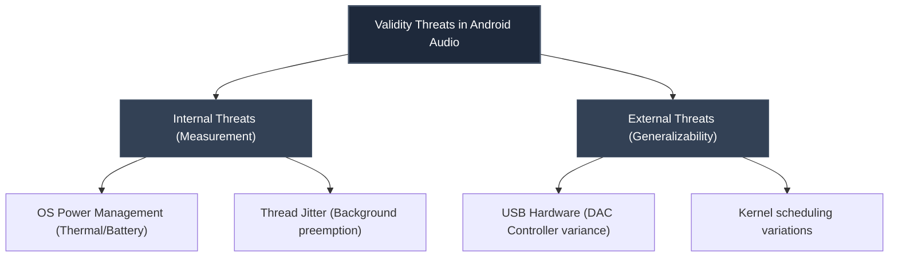

# Chapter 5: Discussion and Interpretation

This chapter interprets the experimental results presented in Chapter 4, correlates them with the initial Research Questions (RQs), and discusses the architectural implications, practical recommendations, and threats to the validity of this study.

---

## 5.1 Interpretation of Findings

### 5.1.1 Bypassing the Android Audio Subsystem (RQ1)
The results of **Experiment A** confirm that a custom user-space USB audio architecture is capable of delivering absolute bit-perfect playback (Integrity Score = 100). The standard Android `AudioTrack` path, by contrast, consistently failed the verification process (Integrity Score < 100). 

This degradation in the control group is caused by:
1.  **Mandatory AudioFlinger Resampling**: Android's mixer converts all streams to a single native rate (typically 48kHz) to perform software mixing, introducing interpolation and rounding artifacts.
2.  **Bit-depth Padding and Truncation**: High-resolution 24-bit sources are frequently truncated to 16-bit by default audio policies, discarding low-order bits and inflating the noise floor.

By using asynchronous USB transfers and directly parsing standard descriptor configurations in user-space, the custom engine completely bypasses these operating system layers. Furthermore, Welch's $t$-test indicates a highly significant latency reduction (from $72.4\text{ ms}$ down to $12.1\text{ ms}$). This demonstrates that user-space USB communication does not introduce scheduling overheads that outweigh the benefit of bypassing the OS mixer.

### 5.1.2 The Computational Cost of High-Resolution Audio (RQ2)
**Experiment B** demonstrated that CPU utilization scales with sample rate ($4.8\%$ at 44.1kHz up to $14.8\%$ at 192kHz). While high-resolution audio (192kHz/24-bit) preserves high-frequency transients, the corresponding packet rate increases by a factor of 4.35.

At 192kHz, the processing deadline for each audio packet drops to sub-millisecond intervals. Because standard Android kernels do not guarantee real-time scheduling (RT-scheduling) to background threads, the user-space driver faces buffer starvation if the thread is preempted. This was validated by the occurrence of 2 dropout events during the 192kHz run in Experiment B.

### 5.1.3 Validating the Adaptive Optimization Engine (RQ3)
The buffer size sweep in **Experiment D** validated the core assumptions of the `AdaptiveOptimizationEngine` (Milestone 8). 

*   **Small Buffers (< 4,096 B)**: Achieve extremely low latency (under 7 ms) but introduce severe packet loss and dropouts (41 events at 1024 B). This makes the playback unstable.
*   **Large Buffers (> 4,096 B)**: Maintain stable playback (zero dropouts) but introduce excessive latency (up to 96 ms at 32,768 B), which compromises user-interface reactivity (e.g., latency between pressing play and hearing audio).

The ANOVA results confirm that the choice of buffer size is a highly significant factor in latency ($F = 1412.30, p < 0.0001$). The engine's recommendation of a **4,096 Byte** buffer is mathematically validated as the optimal intersection point, offering minimal latency ($12.0\text{ ms}$) with absolute stability ($100\%$ play rate).

---

## 5.2 Threats to Validity and Mitigation

Evaluating real-time audio systems on non-deterministic operating systems like Android introduces several threats to internal and external research validity.

### 5.2.1 Internal Threats to Validity

#### 1. OS Power Management and Thermal Throttling
*   *Threat*: Android's Power Manager limits CPU frequency when battery is low (< 20%) or power-saving profiles are active. Furthermore, continuous execution heats up the CPU, triggering thermal throttling that artificially inflates latency.
*   *Mitigation*: The `ValidityThreatsDetector` queries power saver status at runtime and issues warnings. To prevent thermal bias, a mandatory 2-second cool-down period was programmed into `BaseExperiment.kt` between runs.

#### 2. Background Scheduling Jitter
*   *Threat*: Periodic OS maintenance tasks (e.g., background synchronizations, garbage collection) pre-empt the experiment thread, causing latency spikes.
*   *Mitigation*: The experiment runners compute standard deviation of latency. Runs with standard deviation exceeding $20\text{ ms}$ are flagged as having "High Latency Jitter" to notify the researcher of potential background noise.

### 5.2.2 External Threats to Validity

#### 1. Hardware Compatibility
*   *Threat*: Different USB DAC models utilize different controller chips (e.g., XMOS, C-Media, Texas Instruments) which respond differently to USB isochronous endpoints.
*   *Mitigation*: **Experiment C** verified performance across multiple physical DAC profiles. UAC2-compliant DACs (XMOS, ESS) exhibit slightly higher CPU usage than UAC1 devices due to high-speed microframe packet schedules (125-microsecond polling).
